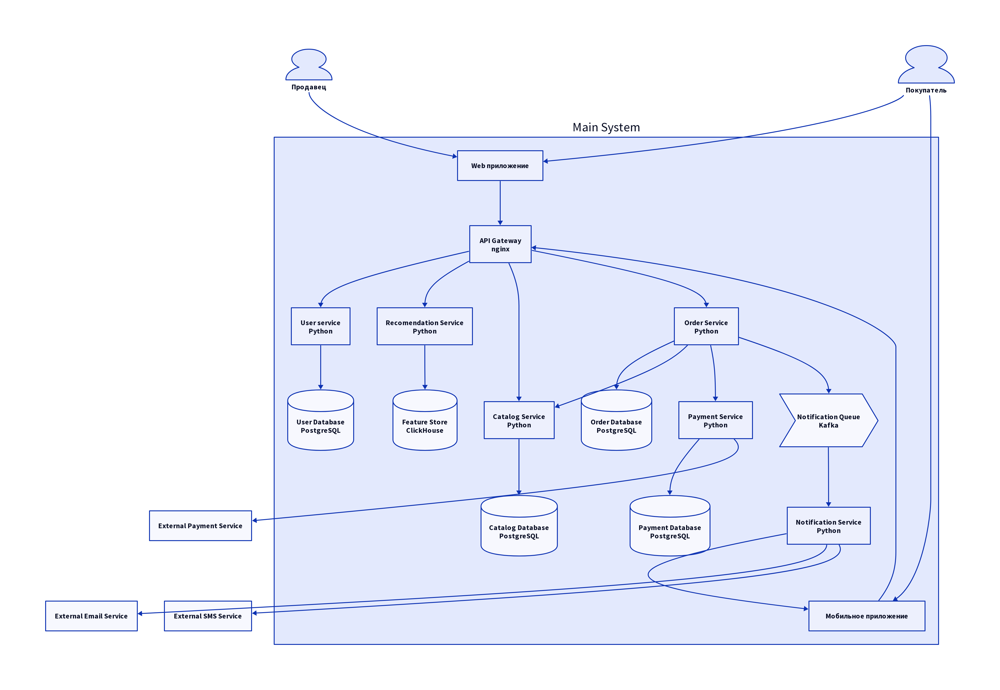

# Домашнее задание #1

Описание архитектуры:

* Тут все сообщения синхронные, кроме, понятно, общения с очередью оповещений
* Все запросы с веб и мобильного приложений проходят через API Gateway для маскирования внутренней структуры системы, а также для авторизации.
* User Service отвечает за создание/удаление покупателей/продавцов, авторизацию и всякое такое
* Recomendation Service отвечает за ленту рекомендаций. С фронта получает сообщения о просмотрах, кликах, заказах для пар (юзер, товар), сохраняет и обрабатывает эти данные, а потом отвечает на юзера подборкой товаров, которые ему подходят (думаю, тут можно сделать обычный векторный поиск)
* Catalog Service отвечает за создание/изменение/удаление товаров. Хранит в себе всякие описания, картинки, количество товара
* Order Service отвечает за процесс заказов от добавления в корзину до завершения. Ходит в Payment Service для оплаты. Асинхронно отправляет оповещения о статусе заказа в Notification Queue
* Payment Service отвечает за оплату заказов. Ходит во внешнего оператора оплаты, а также сохраняет все транзакции себе
* Notification Service читает Notification Queue и рассылает оповещения дальше в push уведомления в приложении или sms или email во внешних сервисах

## UPD
Пишу это уже после дедлайна, надеюсь, высшие силы простят меня. Советую посмотреть историю коммитов, чтобы понять, что менял я только эту часть

#### Запустить проект
`sudo docker-compose up --build`

#### Скрафтить диаграмму
`go install oss.terrastruct.com/d2@latest`

`d2 diagram.d2 diagram.png`

openapi-python-client generate --path ./src/product_service/openapi.yaml --output-path ./src/product_service/lib/ --overwrite

sudo docker run --rm -v "${PWD}:/local" openapitools/openapi-generator-cli generate \
    -i /local/src/product_service/openapi.yaml \
    -g python-fastapi \
    -o /local/src/product_service/lib